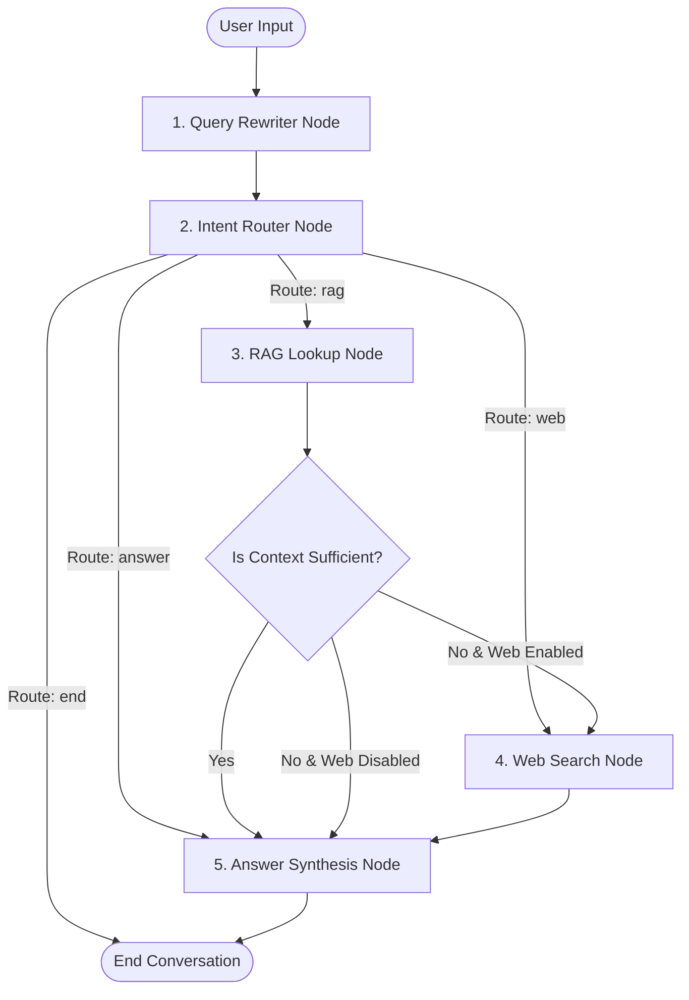

#  Agentic RAG Assistant

> An autonomous, stateful Retrieval-Augmented Generation (RAG) agent built with **LangGraph**, **LangChain**, **FastAPI**, **Pinecone**, **Groq (Llama 3.1 8B Instant)**, and **React + Vite**.


---

## 📌 Overview

The **Agentic RAG Assistant** is a modern, enterprise-ready conversational system that goes beyond simple RAG by incorporating **autonomous decision-making, adaptive routing, self-correction, and fallback capabilities**. 

Unlike rigid linear pipelines, this assistant dynamically rewrites queries for contextual clarity, evaluates query intent, checks local knowledge base relevance via Pinecone, assesses retrieval quality with an LLM judge node, and seamlessly falls back to real-time DuckDuckGo web search when local context is insufficient.

---

## ⚡ Key Features

- **🔄 Conversational Query Rewriting**: Automatically rephrases multi-turn chat questions into standalone queries using conversation history.
- **🧭 Dynamic Intent Router**: Classifies incoming requests to determine whether to query the internal Knowledge Base (`rag`), perform live web search (`web`), answer directly from general LLM knowledge (`answer`), or handle small-talk (`end`).
- **⚖️ LLM Retrieval Judge**: Evaluates Pinecone retrieval results to verify if retrieved context is sufficient and relevant before generating an answer.
- **🌐 Real-Time Web Search Fallback**: Automatically invokes DuckDuckGo search when Pinecone documents are missing or judged insufficient (can be toggled on/off per session).
- **💾 Stateful Conversation Checkpointing**: Persists chat sessions and agent execution graphs using SQLite (`checkpoints.sqlite`).
- **📊 Real-Time Execution Tracing**: Streams fine-grained trace events (`router_decision`, `rag_action`, `web_action`, `answer_generation`) to the React frontend for visual transparency.
- **📄 Instant PDF Ingestion**: Allows users to upload custom PDF documents directly via the UI, automatically chunking, embedding, and indexing them into Pinecone.

---

## 🏗️ Architecture & State Graph Flow

The core workflow is governed by a **LangGraph State Graph**:



---

## 🛠️ Tech Stack

### **Backend**
- **Framework**: [FastAPI](https://fastapi.tiangolo.com/) + Uvicorn
- **Agent Orchestration**: [LangGraph](https://python.langchain.com/docs/langgraph/) (StateGraph & SQLite Checkpointer)
- **LLM Engine**: [Groq API](https://groq.com/) (`llama-3.1-8b-instant`)
- **Vector Database**: [Pinecone Serverless](https://www.pinecone.io/)
- **Embedding Model**: HuggingFace (`BAAI/bge-small-en-v1.5`)
- **Web Search**: DuckDuckGo Search (`duckduckgo-search`)
- **PDF Loader**: PyPDF Loader (`pypdf`)

### **Frontend**
- **Framework**: [React 19](https://react.dev/) + [Vite](https://vitejs.dev/)
- **Icons**: [Lucide React](https://lucide.dev/)
- **Linting**: [Oxlint](https://github.com/oxc-project/oxc)
- **Styling**: Vanilla CSS with custom glassmorphism and modern UI design system

---

## 📂 Project Structure

```
agentbot-main/
├── backend/                      # FastAPI & LangGraph backend service
│   ├── agent.py                  # LangGraph agent definition, state nodes & checkpointing
│   ├── main.py                   # FastAPI REST API endpoints & CORS setup
│   ├── vectorstore.py            # Pinecone integration, HuggingFace embeddings & PDF loader
│   ├── config.py                 # Environment variables configuration loader
│   └── checkpoints.sqlite        # SQLite state persistence database (auto-generated)
├── react-frontend/               # React + Vite web user interface
│   ├── src/
│   │   ├── components/
│   │   │   ├── Sidebar.jsx       # Navigation, Web Search toggle & PDF document uploader
│   │   │   ├── ChatFeed.jsx      # Message history container
│   │   │   ├── ChatInput.jsx     # User input box & submit actions
│   │   │   ├── MessageBubble.jsx # Chat message styling
│   │   │   └── TraceViewer.jsx  # Interactive agent step execution trace logs
│   │   ├── api.js                # API client functions for chat & file uploads
│   │   ├── App.jsx               # Main React container
│   │   └── index.css             # Main styling & visual design tokens
│   ├── package.json
│   └── vite.config.js
├── config.env.example            # Environment variable template
├── requirements.txt              # Backend Python dependencies
└── README.md                     # Project documentation
```

---

## ⚙️ Environment Setup & Configuration

1. Copy the example configuration template:
   ```bash
   cp config.env.example config.env
   ```

2. Edit `config.env` with your API keys:
   ```env
   # Pinecone API Configuration
   PINECONE_API_KEY=your_pinecone_api_key_here
   PINECONE_ENVIRONMENT=us-east-1
   PINECONE_INDEX_NAME=rag-index

   # Groq API Key Configuration
   GROQ_API_KEY=your_groq_api_key_here

   # Embedding Model
   EMBED_MODEL=BAAI/bge-small-en-v1.5

   # Document Source Directory
   DOC_SOURCE_DIR=data
   ```

---

## 🚀 Getting Started

### 1. Prerequisites
- Python 3.10+ installed
- Node.js 18+ and npm installed
- Active [Pinecone](https://www.pinecone.io/) account & API Key
- Active [Groq](https://console.groq.com/) account & API Key

---

### 2. Backend Setup

1. Create and activate a Python virtual environment:
   ```bash
   # Linux / macOS
   python3 -m venv venv
   source venv/bin/activate

   # Windows
   python -m venv venv
   venv\Scripts\activate
   ```

2. Install backend dependencies:
   ```bash
   pip install -r requirements.txt
   ```

3. Start the FastAPI server:
   ```bash
   cd backend
   uvicorn main:app --reload --port 8000
   ```
   The backend API will run on `http://localhost:8000`. You can test the API interactive documentation at `http://localhost:8000/docs`.

---

### 3. Frontend Setup

1. Navigate to the frontend directory:
   ```bash
   cd react-frontend
   ```

2. Install Node.js dependencies:
   ```bash
   npm install
   ```

3. Launch the Vite development server:
   ```bash
   npm run dev
   ```
   Open `http://localhost:5173` in your browser to access the web application.

---

## 🔌 API Reference

### 1. `POST /chat/`
Sends a query to the agent state graph and receives the generated answer along with execution trace logs.

- **Request Body**:
  ```json
  {
    "session_id": "550e8400-e29b-41d4-a716-446655440000",
    "query": "What are the latest updates on space exploration?",
    "enable_web_search": true
  }
  ```
- **Response**:
  ```json
  {
    "response": "Based on recent search results...",
    "trace_events": [
      {
        "step": 1,
        "node_name": "router",
        "description": "Router decided: 'web'",
        "details": { "decision": "web", "reason": "Based on initial query analysis." },
        "event_type": "router_decision"
      },
      {
        "step": 2,
        "node_name": "web_search",
        "description": "Web Search performed. Results retrieved.",
        "details": { "retrieved_content_summary": "..." },
        "event_type": "web_action"
      },
      {
        "step": 3,
        "node_name": "answer",
        "description": "Generating final answer using gathered context.",
        "details": {},
        "event_type": "answer_generation"
      }
    ]
  }
  ```

---

### 2. `POST /upload-document/`
Uploads a PDF file, parses its text, chunks it, embeds it using HuggingFace models, and upserts it into the Pinecone vector index.

- **Request**: Multipart Form Data (`file: <pdf_file>`)
- **Response**:
  ```json
  {
    "message": "PDF 'company_policy.pdf' successfully uploaded and indexed.",
    "filename": "company_policy.pdf",
    "processed_chunks": 14
  }
  ```

---

### 3. `GET /health`
Returns the status of the server.

- **Response**:
  ```json
  { "status": "ok" }
  ```

---

## 💡 Usage Guide

1. **Ingest Documents**: Click **"Upload PDF"** in the sidebar to add custom PDF documents to your local knowledge base.
2. **Chat & Query**: Type any question into the chat bar. Watch the live **Execution Traces** pop up under each agent message showing step-by-step reasoning.
3. **Toggle Web Search**: Use the **Web Search** toggle switch in the sidebar to enable or disable external internet retrieval fallback.

---
